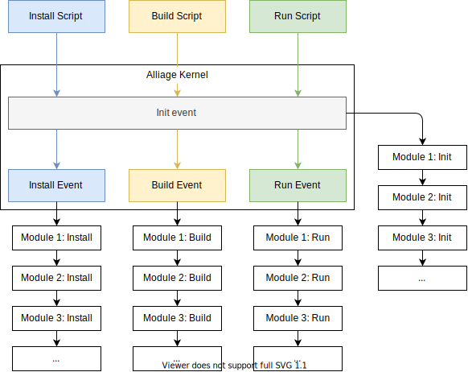

# Alliage

<!-- <p align="center">
  
<p> -->

Alliage is a **minimalist**, **modular** and **non-opinionated** NodeJS Framework.<br />
Behind this complicated description hides a way more simple tool to develop any kind of NodeJS app.

## Installation

Start by installing the following node package

```bash
npm install alliage
```

Then create an empty `alliage-modules.json` file at the root of your project.

```bash
echo "{}" > alliage-modules.json
```

## What does it do?

There's two answers to that question: Alliage does both **nothing** and **anything**.

Why **nothing**? Because as it's a non-opinionated framework, Alliage does not come with any specific built-in features.

Why **anything**? Because Alliage only does what you want it to do, nothing more, nothing less. The only limit is your imagination.

## How does it work?

In the lifecycle of an app, we indentified **3 main steps** that we usually always find:

- ⚙️ **Installation**: It usually sets up things, copies or creates files, install third-party dependencies, etc...
- 🛠 **Build**: It can be about transpiling the code or creating an executable.
- 🚀 **Run**: It just runs the app 🙂

We could indeed imagine even more steps, but those are the most common.

Anyway, based on this statement, Alliage provides one command allowing you to execute **3** different scripts which are (you guessed it): **install**, **build** and **run**.

To do so, you just have to run the following command:

```bash
alliage-scripts [install|build|run]
```

Or if it's installed locally:

```bash
$(npm bin)/alliage-scripts [install|build|run]
```

You'll notice that it does not do anything! That's normal, as we told you earlier, Alliage is not opinionated and won't do anything that you didn't ask it to do.

To make it do things, you'll have to write **modules** containing the logic you want to be executed when you run an Alliage's script.

Before explaining you how to create and register a module, let's have a look to what's happening in Alliage when you execute a script:

<p align="center">
  
</p>

What you can understand of the schema above is that whatever the script you run, Alliage will instanciate the **Kernel** and this kernel will trigger a series of [(not infortunate)](<https://en.wikipedia.org/wiki/A_Series_of_Unfortunate_Events_(TV_series)>) events:

- **init**: Triggered for any script and before any other events
- **install**: Triggered only if it's executed through the install script
- **build**: Triggered only if it's executed through the build script
- **run**: Triggered only if it's executed through the run script

Then, the modules, which are basically simple **event listeners** will be called one by one if they have subscribed to this specific event.

## Create modules

Modules are the **building blocks** of the Alliage Framework. This makes them very powerful while being **extremely easy** to write.

As explained above, modules are just simple event listeners. So the only thing you need to do is make them say which event they want to listen to and what do they want to do when it occurs.

Here's an example:

```js
const { AbstractModule } = require('@alliage/framework');

module.exports = class MyFirstModule extends AbstractModule {
  getKernelEventHandlers() {
    return {
      init: this.onInit,
      run: this.onRun,
    };
  }

  // This method will be called in any case before any other event
  onInit = async (args, env, container) => {
    console.log('Initialization!');
  };

  // This method will be called only when the "run" script is run
  onRun = async (args, env, container) => {
    console.log('Run!');
  }
};
```

A module is simply a class inheriting from `AbstractModule`.
This class must implements a `getKernelEventHandlers` returning a map in which keys are kernel events names and value are method called when the event occurs.

On the example above, our module listens to the `init` event which would call the `onInit` method and the `run` event which would call the `onRun` method.

ℹ️ _Don't care too much about the arguments received in each function, we'll explain their purpose later_ 😉

## Register a module

The registration of a module happens in the `alliage-modules.json` created earlier.

Let's imagine we want to register the module created previously. It just requires to do something like that:

```json
{
  "my-first-module": {
    "module": "./src/my-first-module",
    "deps": []
  }
}
```

Here, we have created a new entry in the object. The key of this entry is a unique name we assign to our module. The value is an object containing the following properties:

- `module`: It's simply the path of the JS file containing the module. It can be an absolute path, a relative path or even the name of a node module.
- `deps`: It defines if your module has a dependency on one or several other modules. For this, you just have to specify the names of the other modules on which this one has a dependency and the it will ensure that these modules are loaded and executed before this one.<br />Example:
  ```json
  {
    "my-first-module": {
      "module": "./src/my-first-module",
      "deps": ["my-second-module"]
    },
    "my-second-module": {
      "module": "./src/my-first-module",
      "deps": []
    }
  }
  ```
  Here, `my-second-module` will be loaded and execute before `my-first-module` because it has a dependency on it.

Now that you have registered your module, you can test that it works properly.

To do so, run the following command:

```bash
$(npm bin)/alliage-scripts run
```

Then you should see the following output:

```bash
Initialization!
Run!
```

But then, if you run the following command:

```bash
$(npm bin)/alliage-scripts install
```

You should only see:

```bash
Initialization!
```

## Parse arguments

Alliage comes with a minimalist arguments parsing feature that was not meant to be exposed initially but as it might suit for really simple use case, we thought there was no reason to keep it just for us !

Of course, if your project consists in creating a complex CLI tool, we would strongly recommand you to use a dedicated library for this.

### The `Argument` class

You might have noticed, in the previous, examples that you receive an `args` variable as first argument. This variable is an instance of the `Arguments` class and has the following methods:

- `get(name: string): boolean|number|string`: Returns the value of a parsed argument. At this level you only have access to the `"script"` argument which correspond to what script is running (`"install"`, `"build"` or `"run"`).
- `getRemainingArgs(): string[]`: Retuns the list of the arguments that wasn't expected by the initial command. That's actually the part that could interest you to build your own CLI.
- `getCommand(): string`: Simply returns the command that has been executed.
- `getParent(): Argument`: Returns the `Argument` instance from which this instance as been parsed.

### Configure the command

If you want to parse the **remaining args** contained in the `args` variable, you'll need to create a `CommandBuilder` like so:

```js
const { CommandBuilder } = require('@alliage/framework');

// ...

onRun = async (args, env, container) => {
  const builder = CommandBuilder.create()
    // The description will be displayed in the command manual
    .setDescription('Description of the command')
    // addArgument will expect a value at a specific position
    .addArgument('arg1', {
      // Displayed in command manual
      describe: 'Arg1 description',
      // Can be "string", "number" or "boolean"
      type: 'string',
    })
    .addArgument('arg2', {
      describe: 'Arg2 description',
      type: 'number',
      // Will only accept these 3 values
      choices: [1, 2, 3],
    })
    // Option are not mandatory and can be positionned anywhere in the command
    .addOption('option', {
      describe: 'Option description',
      type: 'string',
      // Will use this default value if none is provided
      default: 'foo',
    });
};
```

For example, the above configuration would accept the following commands:

```bash
alliage-scripts run test1 2 --option=ok
alliage-scripts run --option=ok test2 1
```

But would refuse those ones:

```bash
# Value not allowed for arg2
alliage-scripts run test1 42 --option=ok

# Missing Arg1
alliage-scripts run --option=ok 1
```

### Parse the command

Once you have configured your command, you'll be able to actually parse it by using the `ArgumentsParser` like below and this will give you another instance of the `Arguments` class in which you'll be able to get the values of each arguments.

```js
const { CommandBuilder, ArgumentsParser } = require('@alliage/framework');

// ...

onRun = async (args, env, container) => {
  const builder = CommandBuilder.create();
  // command configuration...

  const parsedArgs = ArgumentsParser.parse(builder, args);

  // Display the value of the first argument
  console.log(parsedArgs.get('arg1'));

  // Display the value of the second argument
  console.log(parsedArgs.get('arg2'));

  // Display the value of the option "option"
  console.log(parsedArgs.get('option'));

  // Display "true"
  console.log(parsedArgs.getParent() === args);
};
```

## Environment

As you have seen in the event handler of a module, you actually receive an `env` variable as a second parameter. This variable is actually a `string` whose value is the same as the `--env` option used when running an script.

This `env` variable defaults to `"production"` but can take any value you want. It's here to bring more context about the environment in which the script is executed.

Modules can be configured to load only in a specific environment, like so:

```json
{
  "my-first-module": {
    "module": "./src/my-first-module",
    "deps": ["my-second-module"],
    "envs": ["production", "test"]
  },
  "my-second-module": {
    "module": "./src/my-first-module",
    "deps": [],
    "envs": ["development"]
  }
}
```

In the above exemple, `my-first-module` will only be loaded if the environment is `"production"` or `"test"` while `my-second-module` will only be loaded if the environmnent is `development`.

If no `envs` property is set for a module or its value is an empty array, then the module will be loaded whatever is the environment.

## Share information between modules

At some point, when you have several modules registered in your Alliage app, you might want them to share some data or objects.

This is made possible with the `PrimitiveContainer` you receive as the third arguments of your event handlers. The `PrimitiveContainer` is just a simple dictionay in which you can store any kind of data.

Let's imagine you have this first module:

```js
const { AbstractModule } = require('@alliage/framework');

module.exports = class MyFirstModule extends AbstractModule {
  getKernelEventHandlers() {
    return {
      init: this.onInit,
    };
  }

  onInit = async (args, env, container) => {
    // Here we set a new entry called "message" in the primitive container
    container.set('message', 'This message comes from the first module');
  };
};
```

And now, we want to create another module displaying this value when we run the **run** script.

```js
const { AbstractModule } = require('@alliage/framework');

module.exports = class MySecondModule extends AbstractModule {
  getKernelEventHandlers() {
    return {
      run: this.onRun,
    };
  }

  onRun = async (args, env, container) => {
    // Here we get the "message" entry value from the primitive container...
    const message = container.get('message');

    // ...and we display it !
    console.log(message)
  };
};
```

Then, you just have to register these to modules in the `alliage-modules.json` file and run the following command:

```bash
$(npm bin)/alliage-scripts run
```

And you should see the following result:

```bash
This message comes from the first module
```

⚠️ _The primitive container is only writable during the **init** event. During the other events (install, build and run) you'll only have the possibility to read it. This is obviously on purpose as we consider that having the possibility to update it in every events might lead to errors difficult to detect_

The example above is very simple yet the feature itself is very powerful. Indeed, as it gives the possibility for each modules to "communicate" with each other you'll be able to write small modules each focused on a specific piece of logic instead of having a big module doing several things at the same time (which would not really be [SRP](https://en.wikipedia.org/wiki/Single-responsibility_principle) compliant).

The main philosophy behind Alliage is to make you able to compose your app by just plugin to it small blocks of logic in order to make sure that you don't have any superfluous features in your project but only the essential.

## Conclusion

If you have read all the documentation you should have understood that the Alliage framework is really simple.
Actually, you might even think that it's too simple and you would be right !

But that simplicity is actually part of the DNA of this tool. It only brings the essential and if you need more, you can create your own modules or use third-party ones !

<!-- Speaking of that, you might be interested in the official [Alliage Core](https://github.com/TheHumbleJester/alliage-core) modules as they bring a lot of cool features such as:

- Event management
- Dependency injection
- Build pipelines
- Configuration loader
- Autoloading
- Automatic module installation
- etc...

And if you prefer writing your apps in TypeScript, there's also a [module](https://github.com/TheHumbleJester/alliage-typescript) for that 😉 -->
